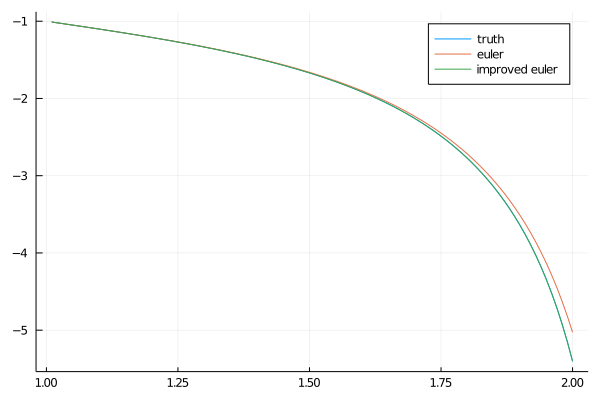
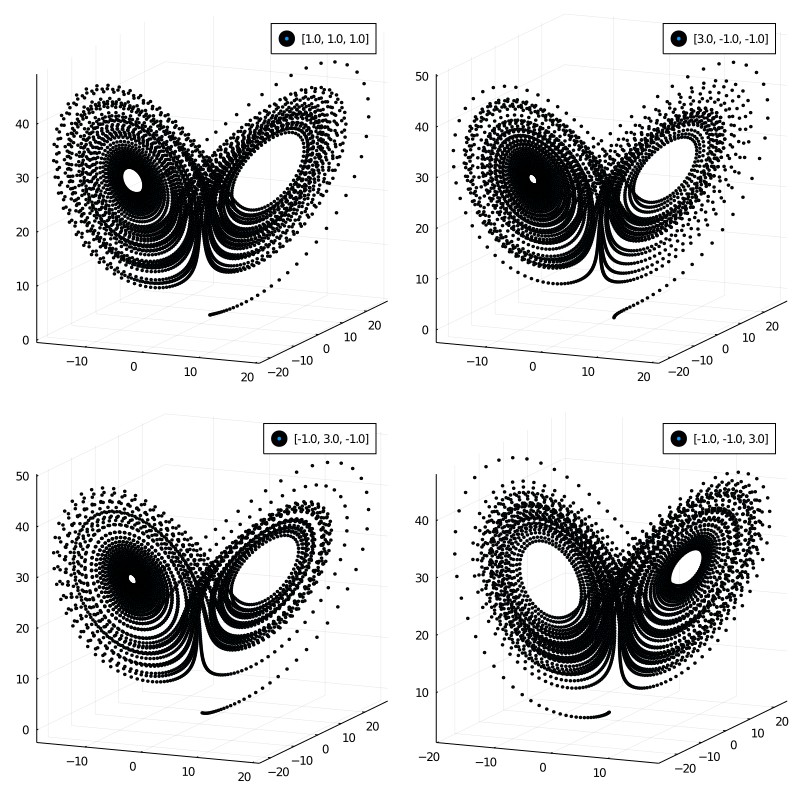
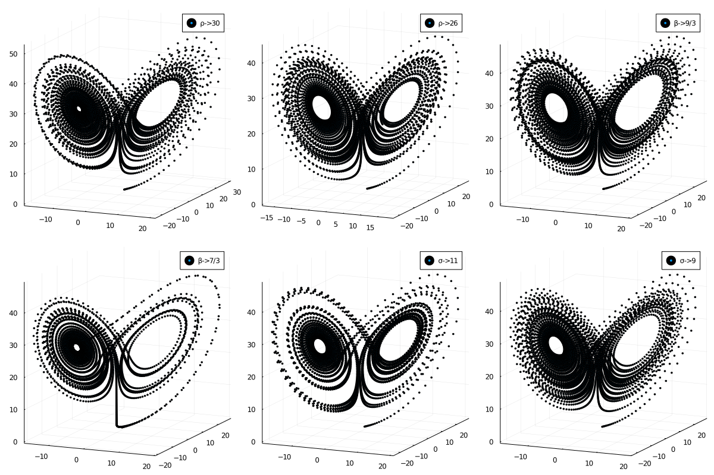

# 报告

## 欧拉法和改进的欧拉法

欧拉法和改进的欧拉法的结果如图所示.

这个方程有精确解:

$$
-\tan (\pi /4 + \log x) / x 
$$

从图中可以看出, 改进的欧拉法和准确解很接近, 欧拉法则在时间步较多的情况下偏离了准确解. 这说明改进的欧拉法中预估 - 校正的思想发挥了作用.

## Lorenz 问题

选择了原点附近的一些点, 计算结果如下图所示. 可以看到从不同起点出发的轨迹, 都收到了两个吸引子的吸引作用. 不具有严格的周期性, 但是在足够长的时间步之后, 会在围绕两个吸引子往复运动.

下面一组结果是改变了参数 $\rho,~\sigma,~\beta$ 之后的结果, 可以看到在参数有微小变化的情况下, 两个吸引子的结构仍然是保持的, 但是缠绕的方式有很大的变化. 这体现了 Lorenz 问题的混沌特性.

