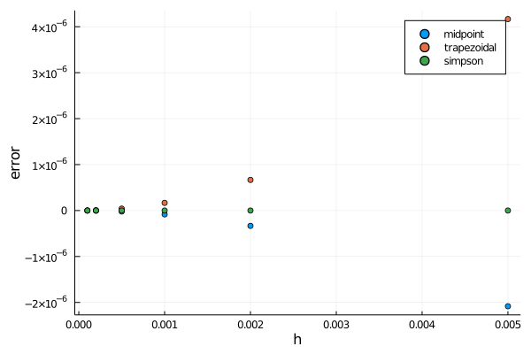
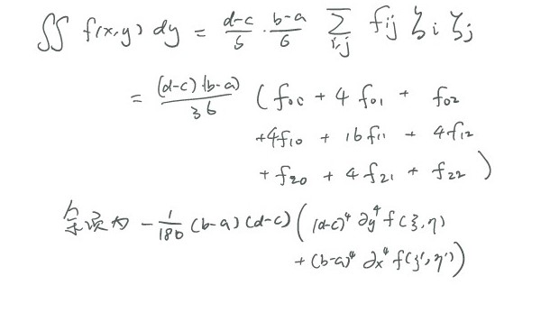

# 报告

## 积分算 $\pi$

我在不同的 $h$ 的值之下用复合中点、复合梯形和复合 Simpson 方法分别计算了积分, 并且得到误差和 $h$ 的关系图如下:

可以看到对于复合中点、复合梯形两种方法, 缩小 $h$ 可以有效地降低误差, 然而 Simpson 方法至少在 $h<0.005$ 误差之后随 $h$ 缩小变化不大. 我认为原因在于已经逼近了数值精度.

## 双重积分

我利用了两重积分的复合 Simpson 方法. 作业题中有对其进行推导, 结果为:

其中对于第二个对于四分之一圆的积分, 我采用了极坐标, 将积分区域转化了矩形. 直接对四分之一圆做分割并运用复合 Simpson 方法也是可行的. 但是对于边缘的处理会复杂很多. 